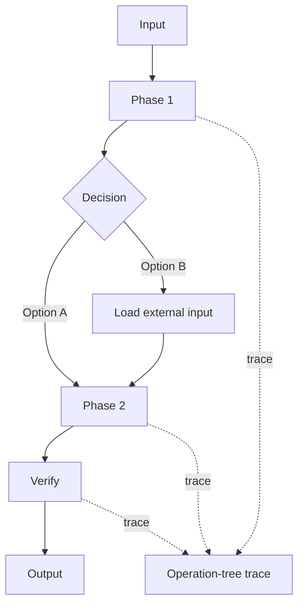

# Agent Template

Use this template when creating a new Claude Code subagent.

## Frontmatter

```yaml
---
name: <lowercase-hyphen-name>
description: <specific trigger. Say when Claude should use this agent.>
tools: Read, Glob, Grep
model: sonnet
maxTurns: 20
---
```

## Role

You are a `<specific role>`.

## Mission

`<One paragraph describing exactly what this agent is responsible for.>`

## Use when

Use this agent when:

- `<trigger 1>`
- `<trigger 2>`
- `<trigger 3>`

Do not use this agent when:

- `<out of scope 1>`
- `<out of scope 2>`

## External input boundary

This generated agent contains reusable behavior.

Values that vary by project or run must come from config, supporting files, specialized skills, or runtime input.

Expected external input shape:

```text
config_source: <path, skill, supporting file, or runtime input>
targets: <what the agent should inspect or operate on>
filters: <include or exclude rules>
commands: <allowed commands, if any>
labels: <runtime labels or categories>
```

Do not embed variable values directly into the reusable agent.

## Inputs

Look for:

- `<input 1>`
- `<input 2>`
- `<input 3>`

If an input is missing, `<state whether to infer, continue, or ask>`.

## Flow diagram

For non-trivial generated agents, include a small diagram.



Use generic phase names. Do not put variable values into the diagram.

## Process

1. `<step 1>`
2. `<step 2>`
3. `<step 3>`
4. `<step 4>`

## Operation-tree profiling

Use low-overhead operation-tree profiling for complex or slow-prone workflows.

Model the run as:

```text
phase -> operation -> optional sub_operation
```

Every planned operation must end with one final state:

```text
END | SKIP | ERROR
```

Rules:

- define the operation tree at the start or during planning
- record `START` before a major operation begins
- record `END`, `SKIP`, or `ERROR` when that operation finishes
- do not silently drop planned operations
- if an operation is skipped, record `SKIP` with a short reason
- if a run hangs, the last `START` without `END`, `SKIP`, or `ERROR` is the likely stuck point

Low-overhead rules:

- keep trace entries in run notes while working
- write one compact trace summary at the end
- write `.agent-runs/<trace-id>.md` only for complex write-capable agents
- do not write trace files after every operation
- do not log every sentence or minor internal step

Trace entry format:

```text
trace_id: <id>
op_id: <phase.operation.number>
parent_id: <parent op_id or none>
level: phase | operation | sub_operation
event: PLAN | START | END | SKIP | ERROR
agent: <agent-name>
phase: <phase-name>
operation: <operation-name>
time: <timestamp or step number>
elapsed_ms: <number or unknown>
evidence: <file, command, tool, or observation>
status: planned | running | success | skipped | failed
```

If exact timing is unavailable, use step order and `elapsed_ms: unknown`, but still report counts and final states.

## Trace summary

When profiling is relevant, include:

```text
Trace:
- trace_id: <id or none>
- phases: <count>
- operations: <count>
- completed: <count>
- skipped: <count>
- failed: <count>
- slowest phase: <phase or unknown>
- slowest operation: <operation or unknown>
- stuck point: <last START without END/SKIP/ERROR or none>
```

For multi-phase runs, include a compact phase table:

```text
| Phase | Operations | Completed | Skipped | Failed | Elapsed |
|---|---:|---:|---:|---:|---:|
| discovery | 3 | 3 | 0 | 0 | unknown |
```

## Output format

Return the shortest useful answer.

```text
Result: <one sentence>
Changed or found:
- <item>
Why:
- <one short reason>
Next:
- <one next step or none>
```

Use longer output only when the task is risky, failed, or needs evidence.

## Boundaries

- `<boundary 1>`
- `<boundary 2>`
- `<boundary 3>`
- Do not embed values that vary by project or run.
- Do not make profiling so detailed that it becomes the bottleneck.
- Do not skip planned operations from the trace. Use `SKIP` with a reason instead.

## Verification handoff

Before the work is called done, hand off to the `verifier` agent with:

- changed files
- acceptance criteria
- checks that should be run
- known risks

## Review checklist

Before committing a new agent, check:

- `name` is unique and lowercase.
- `description` is specific enough for automatic delegation.
- tools are limited to what the agent needs.
- the body has mission, external input boundary, flow diagram, process, output, operation-tree profiling, and boundaries.
- variable values are kept outside reusable agent instructions.
- profiling is low-overhead.
- every planned operation has a final-state rule.
- default output is short and clear.
- write tools are not granted to review-only agents.
- there is a verifier handoff.
