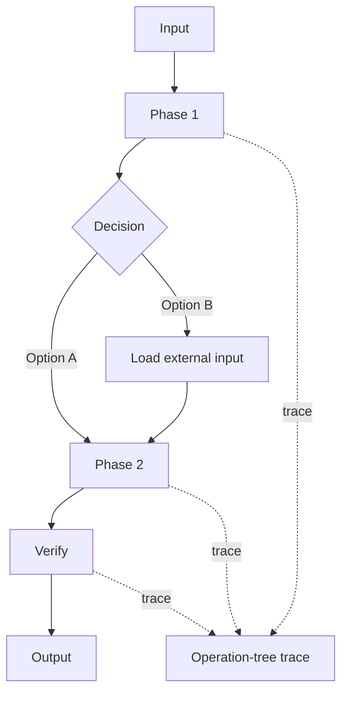

# Agent Flow Architecture Template

Use this template when a user describes a messy workflow and expects the agent system to decide how to structure it.

## User problem

```text
<describe the workflow or pain>
```

## Failure pattern

What is going wrong now?

- [ ] too many global instructions
- [ ] agent skips verification
- [ ] agent asks for too many confirmations
- [ ] one prompt mixes planning, writing, and reviewing
- [ ] reusable logic is mixed with values that vary by project or run
- [ ] generated-agent flow is hard to understand without a diagram
- [ ] generated agent is slow or hard to debug
- [ ] context gets polluted by logs or search results
- [ ] different steps need different tools
- [ ] user no longer trusts the result
- [ ] other: `<describe>`

## Architecture decision

| Instruction type | Artifact | Reason |
|---|---|---|
| Stable project-wide rule | `AGENTS.md` | Always relevant |
| Repeatable procedure | skill | Load only when needed |
| Role-specific work | `.claude/agents/<name>.md` | Own context and tools |
| Values that vary by project or run | config, supporting file, specialized skill, or runtime input | Keep reusable agent generic |
| Flow shape | `templates/generated-agent-flow-diagram.md` or agent section | Makes the algorithm visible |
| Trace shape | `templates/agent-run-trace.md` or agent section | Makes slow or stuck runs diagnosable |
| Output shape | `templates/<name>.md` | Reusable structure |
| Done criteria | `templates/verification-contract.md` or local contract | Evidence-based verification |
| Predictable deterministic action | prepared support script or documented command | Prevents ad hoc helper code during generated-agent flow |

## Proposed core flow

```text
agent-architect -> agent-writer -> verifier
```

If a generated agent later runs slowly or gets stuck:

```text
generated agent trace -> agent-flow-profiler
```

## External input boundary

Reusable generated agent logic:

```text
<what stays inside the agent>
```

External inputs:

```text
<what comes from config, supporting file, specialized skill, or runtime input>
```

## Support script decision

Use support scripts only when the generated agent has predictable deterministic work that should already exist before the normal flow runs.

Document the owner, location, install command if needed, run command, README update, and verifier check.

Do not add scripts just because an agent exists.

## Generated-agent flow diagram

Use Mermaid when useful:



Or use a plain text diagram.

## Operation-tree profiling

Generated agents should model work as:

```text
phase -> operation -> optional sub_operation
```

Every planned operation must finish as:

```text
END | SKIP | ERROR
```

If an operation is skipped, record `SKIP` with a short reason.

If a run gets stuck, the likely stuck point is the last `START` without `END`, `SKIP`, or `ERROR`.

Keep profiling low-overhead: keep trace entries in run notes, write one compact summary at the end, write trace files only for complex write-capable agents, and do not log every sentence or minor internal step.

## Subagents

| Agent | Role | Tools | Config boundary | Diagram | Profiling | Why separate |
|---|---|---|---|---|---|---|
| `<name>` | `<role>` | `<tools>` | `<source>` | yes/no | yes/no | `<reason>` |

## Skills

| Skill | Trigger | Why skill instead of agent |
|---|---|---|
| `<name>` | `<when used>` | `<reason>` |

## Verification contract

| ID | Criterion | Required evidence |
|---|---|---|
| AC1 | `<criterion>` | `<file, command, or observation>` |
| AC2 | `<criterion>` | `<file, command, or observation>` |
| AC3 | `<criterion>` | `<file, command, or observation>` |

## Tool permission review

- Read-only agents do not have Write or Edit.
- Writer agents have only the tools needed to modify target files.
- Verifier agents can inspect files and run safe checks, but should not edit files.
- Side-effect workflows are not auto-invoked.

## Done

The architecture is acceptable when:

- each artifact has one clear responsibility
- reusable logic is separated from values that vary by project or run
- non-trivial generated agents have a small flow diagram
- non-trivial generated agents have operation-tree profiling
- prepared support scripts exist only when deterministic generated-agent work should be available before the flow runs
- no single agent both writes and final-approves its own work
- long procedures are not placed in global instructions
- verification criteria are explicit
- open risks are documented
