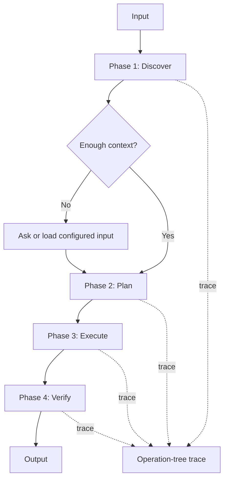

# Generated Agent Flow Diagram Template

Use this template for non-trivial generated agents.

## Goal

Show the generated agent flow as a small block diagram before or inside the agent design.

The diagram should make it clear:

- what phases exist
- what operations happen in each phase
- where decisions happen
- where handoffs happen
- where verification happens
- where operation-tree profiling is recorded

## Rule

The architect owns the flow diagram.

The writer implements the agent from that diagram.

The verifier checks that the diagram exists when needed and does not include variable project or run values.

## Keep it small

Use a diagram only when the generated agent has more than one meaningful phase, branch, handoff, or verification step.

For one-step agents, a short process list is enough.

## Mermaid template



## Plain text fallback

Use this when Mermaid is not wanted:

```text
Input
 -> Phase 1: Discover
 -> Decision: enough context?
    -> no: load configured input
    -> yes: continue
 -> Phase 2: Plan
 -> Phase 3: Execute
 -> Phase 4: Verify
 -> Output

Trace: each phase records operation-tree entries.
```

## Diagram checklist

- Uses generic phase names, not project-specific names.
- Shows decisions and handoffs.
- Shows verification.
- Shows where trace is recorded.
- Does not include values that should come from config.
